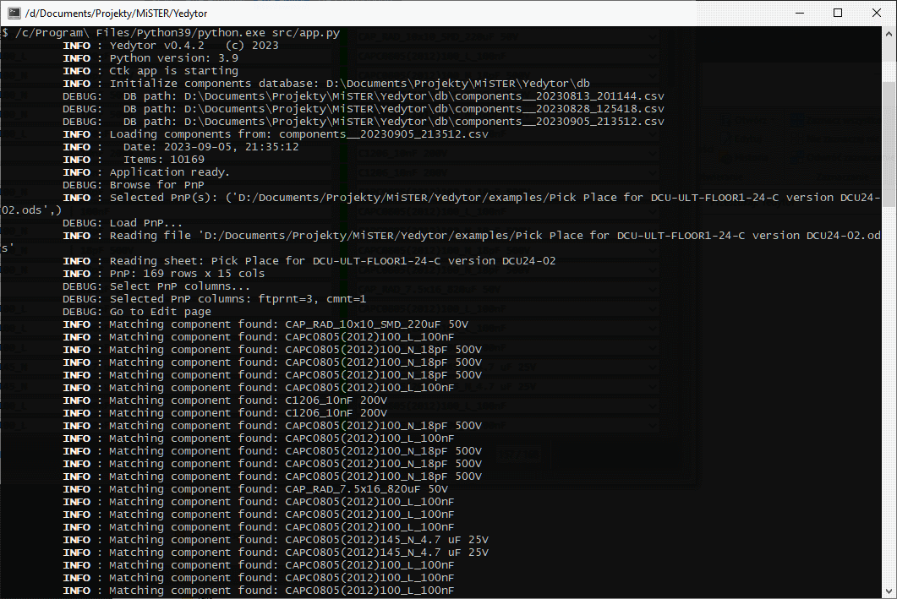

# Yedytor

PnP files editor, using footprints defined in Yamaha .Tou files.

TODO: sshots

## Supported formats

* Yamaha project file
  * .Tou
* [PnP](. "Pick And Place")
  * .xls
  * .xlsx
  * .ods
  * any other extension - considered as a CSV file

> NOTE
>
> If xls/xlsx/ods file contains several sheets, only the first one will be used.

## Prerequisites

### Python

[Python for Windows with addons](https://www.python.org/).
Remember to check these options:

* pip
* tcl\tk
* Add Python to environment variables

Minimum required version is **Python 3.9**.

### Libraries

To install required libraries, open the PowerShell and:

```ps1
# .xls reader, .xlsx reader, .ods reader, UI lib, natural sorting, http requests, image formats
pip install xlrd openpyxl odfpy customtkinter natsort requests pillow
```

## How to run

From PowerShell:

```ps1
python.exe src/app.py
```

To get colored logs, use Linux-like terminal, eg. [MSys2](msys2.org/), but still using the Windows installation of the Python:

```sh
$ /c/Program\ Files/Python39/python.exe src/app.py
```



## Trouble shooting

* *ModuleNotFoundError: No module named 'tkinter'*

  `tkinter` was not installed together with the Python -
  follow the instructions [here](https://bobbyhadz.com/blog/python-no-module-named-tkinter).
* *ERROR: Cannot load BOM: 'utf-8' codec can't decode byte*

  Only UTF-8 files are accepted; if the BOM or PnP file uses ANSI or WINDOWS encoding, use `Notepad++` or other editor to change the encoding to UTF-8
*
